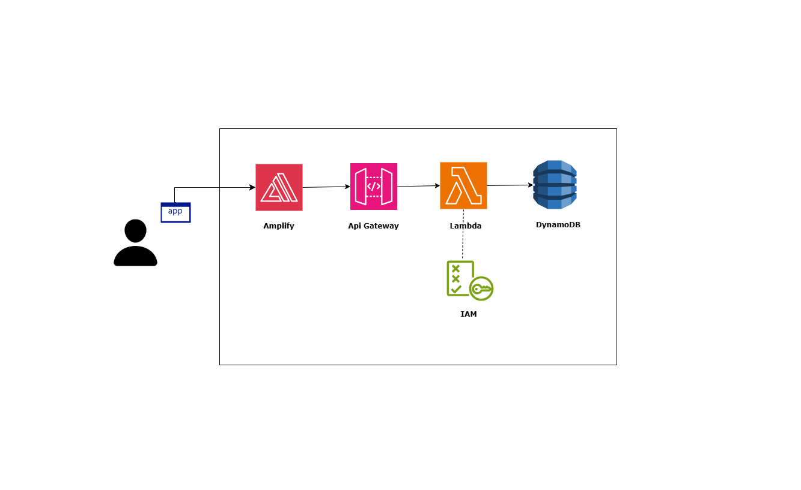

# Power of Math Project

## Overview
This project demonstrates the integration of AWS services (Amplify, API Gateway, Lambda, and DynamoDB) to create a simple application that calculates the power of a number. The results are stored in a DynamoDB table.

## Architecture

### Key Components:
1. **Amplify**: Hosts the frontend.
2. **API Gateway**: Routes API requests to the Lambda function.
3. **Lambda**: Executes the mathematical operation and writes results to DynamoDB.
4. **DynamoDB**: Stores the computation results.

## Files in the Repository:
- `index.html`: The frontend file with an HTML form and JavaScript to call the API.
- `LambdaFunction.txt`: Python code for the Lambda function.
- `Lambda-DynamoPolicy.txt`: IAM policy for granting DynamoDB access to the Lambda function.
- `AWS_PROJECT.png`: Architecture diagram.

## How to Run
### Prerequisites:
- AWS account with Amplify, API Gateway, Lambda, and DynamoDB set up.
- Basic knowledge of Python and HTML.

### Steps:
1. Deploy the Lambda function:
   - Use the code in `LambdaFunction.txt`.
   - Assign the `Lambda-DynamoPolicy.txt` as the IAM policy.
2. Set up API Gateway:
   - Connect it to the deployed Lambda function.
3. Deploy the frontend:
   - Host `index.html` using Amplify or another static web hosting service.
4. Test the application:
   - Enter a base and exponent in the form and view the calculated result.

## Contact
For any questions, feel free to reach out.
